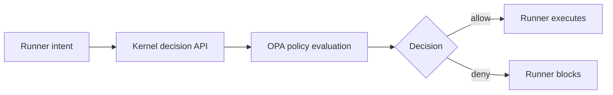

# AGenNext-Kernel

AGenNext-Kernel is the **governance layer** of the AGenNext platform. It evaluates policy, enforces control decisions, and produces auditable outcomes for all requested actions.

Kernel does not execute agents. Use **AGenNext-Runner** for execution.

## What it does

- Central policy decisioning for agent and tool actions.
- Policy enforcement using OPA/Rego.
- Tenant-aware governance controls.
- Immutable decision/audit trail.
- Control-plane endpoints for decision and policy lifecycle.

## What it does **not** do

- Run agents or workflows.
- Execute third-party integrations.
- Orchestrate runtime retries or task scheduling.

## Integration with Runner

Runner sends action intents to Kernel and waits for an allow/deny decision before execution.



## Rego policy example

```rego
package agennext.authz

default allow := false

allow if {
  input.action == "tool.call"
  input.resource.type == "http"
  startswith(input.resource.id, "readonly-")
}
```

## Documentation

- [Architecture](docs/architecture.md)
- [API](docs/api.md)
- [Policies](docs/policies.md)
- [Tutorial: Policy Enforcement](docs/tutorial-policy-enforcement.md)
