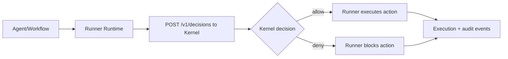

# AGenNext-Runner

AGenNext-Runner is the **execution layer** of the AGenNext platform. It runs agents, workflows, and integrations after every action is validated by **AGenNext-Kernel**.

> All actions are validated by Kernel before execution.

## What Runner does

- Executes agent workflows and runtime jobs.
- Integrates with tools, APIs, and data systems.
- Submits action intents to Kernel for policy decisions.
- Enforces allow/deny responses from Kernel at runtime.
- Emits execution telemetry and audit events.

## What Runner does **not** do

- Author governance policy.
- Make final policy decisions.
- Replace centralized audit and control-plane responsibilities.

For governance and policy enforcement, use **AGenNext-Kernel**: `../AGenNext-Kernel` (or your Kernel repository URL).

## Execution flow with policy check



## Minimal integration example

```bash
curl -X POST "$KERNEL_URL/v1/decisions" \
  -H "Content-Type: application/json" \
  -H "Authorization: Bearer $KERNEL_TOKEN" \
  -d '{
    "tenant_id": "acme",
    "actor": {"type": "agent", "id": "agent-support-1"},
    "action": "tool.call",
    "resource": {"type": "http", "id": "crm-api"},
    "context": {"method": "POST", "path": "/customers"}
  }'
```

If `decision=allow`, Runner proceeds. If `decision=deny`, Runner blocks and records reason.

## Documentation

- [Agents](docs/agents.md)
- [Runtime](docs/runtime.md)
- [Integrations](docs/integrations.md)
- [Kernel Integration](docs/kernel-integration.md)
- [Tutorial: First Agent](docs/tutorial-first-agent.md)
