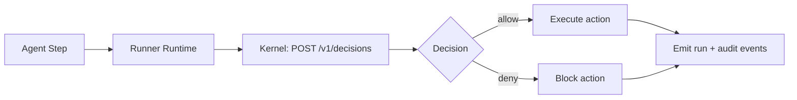

# AGenNext-Runner

AGenNext-Runner is the **execution layer** of the AGenNext platform.
It runs agents, workflows, and integrations, and defers governance decisions to **AGenNext-Kernel**.

- Kernel repo: https://github.com/AGenNext/AGenNext-Kernel
- Contract: every sensitive action is validated by Kernel before execution.

## Responsibilities

### What Runner does
- Execute agent tasks and workflow steps.
- Route tool/integration calls (HTTP, DB, queues, internal adapters).
- Request policy decisions from Kernel for side-effecting actions.
- Enforce allow/deny outcomes at runtime.
- Emit execution telemetry for operations and audit.

### What Runner does **not** do
- Define governance policy.
- Evaluate OPA/Rego policy bundles.
- Act as the policy source of truth.

For governance and policy tutorials, use **AGenNext-Kernel**.

## Execution Flow (Policy-Gated)



## Kernel Decision Check Example

```bash
curl -X POST "$KERNEL_URL/v1/decisions" \
  -H "Authorization: Bearer $KERNEL_TOKEN" \
  -H "Content-Type: application/json" \
  -d '{
    "tenant_id": "acme",
    "actor": {"type": "agent", "id": "agent-support-1"},
    "action": "tool.call",
    "resource": {"type": "http", "id": "crm-api"},
    "context": {"method": "POST", "path": "/customers"}
  }'
```

If Kernel returns `allow`, Runner executes. If Kernel returns `deny`, Runner blocks and records the reason.

## Documentation

- [Agents](docs/agents.md)
- [Runtime](docs/runtime.md)
- [Integrations](docs/integrations.md)
- [Kernel Integration](docs/kernel-integration.md)
- [Tutorial: First Agent](docs/tutorial-first-agent.md)
